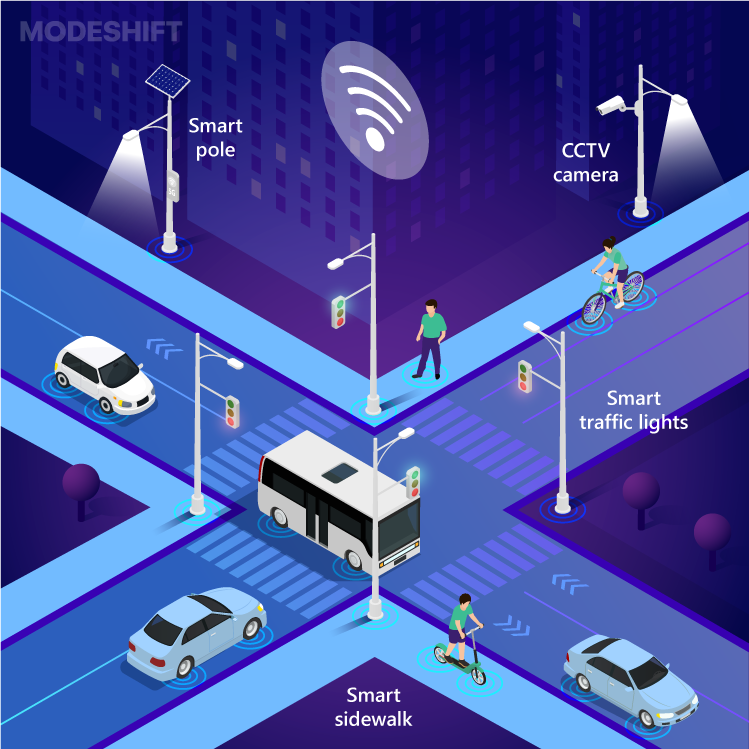

# Real-Time Traffic Monitoring and Control System

This is a web-based system for **real-time traffic monitoring and control**, built using **Flask**, **OpenCV**, and **MySQL**. It features user login/signup, video input analysis, and traffic data management using a web interface.

---

## 🚦 Features

- Live camera/video upload and playback
- User registration and admin panel
- Real-time traffic direction analysis
- MySQL database integration
- Secure password storage and session management

---

## 🛠️ Tech Stack

- **Frontend**: HTML, CSS, Jinja2
- **Backend**: Flask (Python)
- **Database**: MySQL (via XAMPP or local server)
- **ML Model**: YOLO (Ultralytics)
- **Deployment**: GitHub Codespaces

---

## 📷 Demo



> *(Replace `image.png` if your demo image has a different name)*

---

## 🧪 How to Run This Project

1. **Clone the repo**  
   ```bash
   git clone https://github.com/ShreyaSirigada/Majorproject.git
   cd MajorProject

2. **Create a virtual environment**
   ```bash
   python3 -m venv venv
   source venv/bin/activate

3. **Install dependencies**
   ```bash
   pip install -r requirements.txt

4. **Start MySQL Server(if using XAMPP or local DB)** 
   ```bash
   sudo service mysql start

5. **Run the Flask app**
   ```bash 
   python app1.py

# Ignore virtual environment
.venv/
__pycache__/
*.pyc

# Ignore system files
.DS_Store
*.swp

# Ignore uploaded files and logs (optional)
static/uploads/
*.log